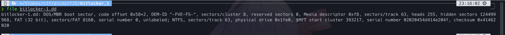
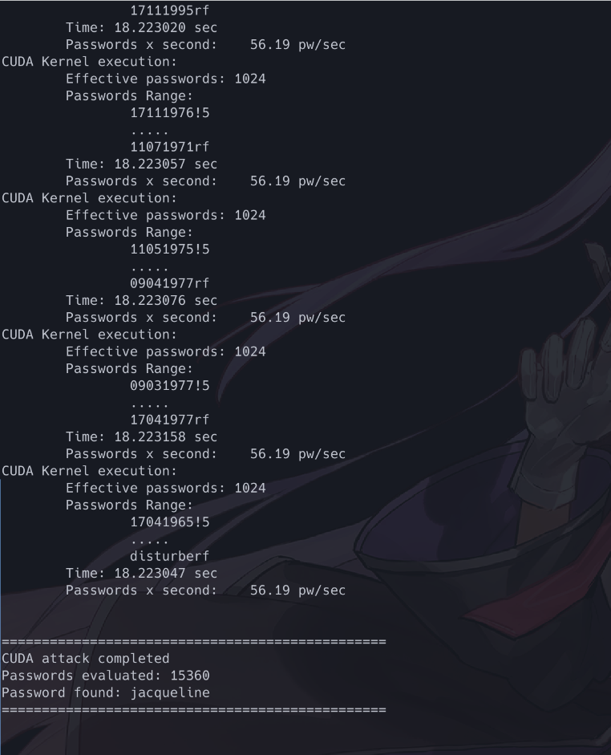

# PicoCTF 2025 writeup-written by MoonCeII

## 1, Disclaimer

This is my first competitive CTF. I've mostly read writeups and do exercises on picoGym. I will document this CTF by order of me solving it.

## 2, Web Exploitation

### Cookie Monster Secret Recipe-50 points

Here's the challenge's description


Going to the site, we see a basic login form.

    As the challenge's name suggest, we should check the cookie. Logging in with a random credentials ala a:a returns us a access denied screen.

 However, checking the cookies, we see a cookie with the name secret_recipe with a value that seems to be a Base64 encoded string ***"cGljb0NURntjMDBrMWVfbTBuc3Rlcl9sMHZlc19jMDBraWVzXzc3MUQ1RUIwfQ%3D%3D"***.(%3D is "=" encoded)

Putting it through a base64 decoder of your choice(usually cyberchef) nets you the flag ***picoCTF{c00k1e_m0nster_l0ves_c00kies_771D5EB0}***.


### Head-dump-50 points

Here's the challenge's description

Heading into the site, we see an innocuous news site with not much to see.

Most of the elements like the edit and comment button are for show, however the hashtags has links embeded in them. Hovering through all of the hashtags shows the #API Documentation pointing to a different site ***[URL](http://verbal-sleep.picoctf.net:50120/api-docs/)***.

This site lists all the available APIs, but we pay special interest in the heapdump api as it bears a similar name to our challenge's title. You can access this API by yourself using wget or curl, however the site gives you the link to save time or the curl command to get the file.

Going to the given url gives us a heapsnapshot file. Opening it with your favored hex editor and search for pico gives us the flag ***picoCTF{Pat!3nt_15_Th3_K3y_13d135dd}***.

To be honest, I kinda zoned out doing this so all of my steps are through the frontend and through GUI. you can use curl and grep the response to shorten the process


### n0s4n1ty 1-100 points

Here's the challenge's description


Going to the given url returns us a file upload page.


Inspecting the source file shows us the site is written in php, indicated by the page's file upload.php.


Furthermore, inspecting the loadFile function in the image upload input field.

```javascript
        var loadFile = function(event) {
            var input = event.target;
            var file = input.files[0];
            var type = file.type;
            var output = document.getElementById('preview_img');


            output.src = URL.createObjectURL(event.target.files[0]);
            output.onload = function() {
                URL.revokeObjectURL(output.src) // free memory
            }
        };
```

We see that the frontend provides no file input validation as it does not check for mime type or file extension. This heavily hints towards a file upload vulnerability. we then craft a basic php test file to affirm our hypothesis.

```php
<?php
//test.php
phpinfo();
phpinfo(INFO_MODULES);

?>
```

after uploading, the site give us an url that points to the file. Going to the file confirms our suspicion as the phpinfo function is executed.

Now we upload a [basic php webshell](https://gist.github.com/joswr1ght/22f40787de19d80d110b37fb79ac3985) copied from github.
Going to the newly uploaded file, we can see that our webshell suceeded. We then try to see files inside the /root directory. However we've been denied permission.

We now need to escalate our privileges, and the simplest way to do that is to add sudo to our command. Typing "sudo ls /root" shows that there's a flag.txt file

We then read the file with cat with the command "sudo cat /root/flag.txt", and in it is our flag: ***picoCTF{wh47_c4n_u_d0_wPHP_f7424fc7}***.


### SSTI1-100 points

Here's the challenge description.


The name of the challenge hints at the [server side template injection vulnerability](https://portswigger.net/web-security/server-side-template-injection).
Going to the site, we see that anything we type will get shown on submit.


To test for ssti, we enter {{7*7}} to test according to [payload of all things](https://github.com/swisskyrepo/PayloadsAllTheThings/blob/master/Server%20Side%20Template%20Injection/README.md?ref=sec.stealthcopter.com)

The output is 49, proving the site is vulnerable to ssti and the template engine is jinja 2.With an ssti vulnerability we can try to achieve remote code execution(RCE) with the following payload.

```python
{{ config.__class__.from_envvar.__globals__.__builtins__.__import__("os").popen("ls").read() }}
```

using the payload shows us all the files in the current web root including our "flag" file.

To get our flag, we substitute "ls" in popen with "cat flag". ***picoCTF{s4rv3r_s1d3_t3mp14t3_1nj3ct10n5_4r3_c001_424a1494}***


### WebSockFish-200 points

Here's the challenge description.

Going to the site we see a chessboard. Players play until they win, and they get a flag for their effort. However, this is picoCTF and not chess.com so we will have to cheat.

Inspecting the source code, we see that the webapp communicates to the server the victor and the state of the board through websocket. The function sendMessage will be used to communicate with the server.

Search sendMessage nets us to this part of the source


As you can see, the frontend will ask the server to either evaluate the state of the game through "eval" or inform the server the victor through "mate"

The first instinct here is to send to the server that we have achieve "mate" with a number that indicates we won. To do that, we spin up our VM with burp suite installed. In BurpSuite, we go to the Proxy tab and go into the WebSocket history. From there, we open the burp browser, turn on intercept and enter our site. Now we try to move our piece and burp will capture a packet with the data eval and a integer.


We send that packet to the repeater and modify the value to be mate with an int. However, trying mate with a negative integer show that we did indeed win but the fish will not release the flag, and a positive integer means we're nearing a loss.


So winning through mate is impossible, we now return to the "eval" command. As seen in the first example, -17 is a valid position, so if we enter a int it has to be absurdly high or low. Inputing a big negative integer seems to do the trick as the fish relent and give us our flag ***picoCTF{c1i3nt_s1d3_w3b_s0ck3t5_e5e75e69}***.

Just for curiosity sake, I also try with a big positive int and it resulted in an illegal move.


### 3v@l-200 points

Here's the challenge description


In accordance to the challenge's title, this will most likely relate to a command injection vulnerability. Going to the site, we get a calculator app.


Opening up the view source, we see that the input is sanitized, and the app is running in python flask.


As it's shown in the picture, several popular bash commands are blacklisted, and a regex is implemented that prevents words joined by a dot (aka executing functions from object in python), back slash, forward slash and two dots(indicating the parent directory). At least that is what the [regex analysis site](https://regex101.com/) told me (lol). This means our payload back in SSTI 1 won't work as it contains "os", however, opening one of the hint suggests dynamic construction so our answer in SSTI 1 is on the right track. The hint also suggest encoding so after looking at the bypass payload in [hacktricks](https://book.hacktricks.wiki/en/linux-hardening/bypass-bash-restrictions/index.html), I've arrived at this payload.

```python
[x for x in  [].__class__.__base__.__subclasses__() if x.__name__ == 'BuiltinImporter'][0]().load_module('o'+'s').popen("ca"+"t `echo L2ZsYWcudHh0 | base64 --decode`").read()
```

In this payload, we will use string concatenation to avoid the blacklist as well as encoding our flag's path in base64 in order to avoid the double dots and forward slash regex. Thus, we got our flags ***picoCTF{D0nt_Use_Unsecure_f@nctions68288869}***.


Ps: the hint shows the position of the flag is in /flag.txt. However doing it blind is also ok if you are willing to use ls to escape the webroot using base64 to encode the path and string concat like 'l'+'s'.

### SSTI 2-200 points

Here's the challenge's description


It's SSTI2: Electric Boogaloo, coming back with a vengenge and a whole lot more filters.


Testing {{7*7}} still results in 49, but testing the payload back in ssti 1 resulted in the command being filtered.


After some intensive googling, I've arrived at [the payload](https://www.onsecurity.io/blog/server-side-template-injection-with-jinja2/). It is as follows.

```python
{{request|attr('application')|attr('\x5f\x5fglobals\x5f\x5f')|attr('\x5f\x5fgetitem\x5f\x5f')('\x5f\x5fbuiltins\x5f\x5f')|attr('\x5f\x5fgetitem\x5f\x5f')('\x5f\x5fimport\x5f\x5f')('os')|attr('popen')('id')|attr('read')()}}
```

altering the command from 'id' to 'ls' shows that the flag is in the webroot


adding 'cat flag' to the command gives us the flag ***picoCTF{sst1_f1lt3r_byp4ss_0ef4bd3d}***.


### Apriti sesamo-300 points

Here's the challenge's description.


Going passed the index.php, we are met with a login form in php.


I'll be honest here, I've got minimal experience in php. So when the hint point us to a backup file, I can't find anything. It is only after scanning with burpsuite where I found out that adding a ~ after the file gives you the backup of that file. The scan results is several days after the write up so I can't show it, but viewing the source of impossibleLogin.php~ gives us the following authentication logic.


After formatting the code and deobfuscate the names of the variable, we have the following code

```php
<?php
if (isset($_POST["username"]) && isset($_POST["pwd"])) {
    $yuf85e0677 = $_POST["username"];//username
    $rs35c246d5 = $_POST["pwd"];//password
    if ($yuf85e0677 == $rs35c246d5) {
        echo "<br/>Failed! No flag for you";
    } else {
        if (sha1($yuf85e0677) === sha1($rs35c246d5)) {
            echo file_get_contents("../flag.txt");
        } else {
            echo "<br/>Failed! No flag for you";
        }
    }
} ?>
```

sha1 function in php is known to have a vulnerability called [loose comparision/type juggling](https://github.com/swisskyrepo/PayloadsAllTheThings/blob/master/Type%20Juggling/README.md) where there are magic hashes that when compared with loose equal aka "==", It will equals to zero. However the hash here uses strict comparision "===" so the idea goes to the bin. Searching the net shows that sha1 has already faced hash collisions, although it is with pdf files and not text. This causes my fried brain to disregard that direction entirely and waste an entire afternoon looking for answers. That is until I stumbled upon a write up from a [CTF](https://www.linkedin.com/pulse/using-sha1-collision-attack-solve-bostonkeyparty-ctf-rotimi) back in 2017. Taking "inspirations"(wink wink) from the write up, I've arrived at my python script.

```python
#sesame.py
import requests
import urllib
rotimi = urllib.request.urlopen("http://shattered.io/static/shattered-1.pdf").read()[:500];
letmein = urllib.request.urlopen("http://shattered.io/static/shattered-2.pdf").read()[:500];
# replace the URL with your domain
r = requests.post("http://verbal-sleep.picoctf.net:53626/impossibleLogin.php", data={'username': rotimi, 'pwd': letmein});

print(r.text)
```

which returns the flag ***picoCTF{w3Ll_d3sErV3d_Ch4mp_233d4a80}***.


### Web closing words

And that's the end of the road for me in web exploitations. The two pachinko challenges involve webassembly which is completely unknown territory for me, and unlike the average Japanese middle aged man in a pachinko parlor, I gave up. The two pachinko machines caused me so much grief that it completely shot all of my confidence, so I didn't even bother building the docker image for secure-email-service. After this, I tried taking shots at a few easier problems from other category that is outside of my specialization to try to get pass that 2000 mark.

## 3, General Skills

### Fantasy CTF-10 points

Here's the challenge's description.


This is the participation awards for this competition. You connect to the domain with netcat and answer according to the code of conduct and you receive a flag ***picoCTF{m1113n1um_3d1710n_76b680a5}***.

### Fixme1-100 points

Here's the challenge's description.


Downloading the source code, we see that the rust snippet is broken, with question mark around the broken lines. Fixing the return, the format of the println function and the correct delimeter after a statement and compiling it resulted in our flag ***picoCTF{4r3_y0u_4_ru$t4c30n_n0w?}***.


### Fixme2-100 points

Here's the challenge's description.


Same as fixme1, but the source code now is broken in the borrowing mechanism. Adding &mut whenever using the borrowing mechanic fixes the source code and compiling it gives us the flag ***picoCTF{4r3_y0u_h4v1n5_fun_y31?}***.


### Fixme3-100 points

Here's the challenge's description.


Similar to the previous fixmes, we are given a broken main function. This is probably the easiest of the three as it involves the unsafe rust operations, so we only need to surround the code with the unsafe keyword or in this case uncomment the unsafe keywork. Compiling this returns us the flag ***picoCTF{n0w_y0uv3_f1x3d_1h3m_411}***.

### General skills closing words

The only problem left is the Yara rule challenge, but I've procrastinated and in the end didn't have much motivation and time to learn yara from scratch, so maybe we meet again in the picoGym. The fixme problems are all unsastisfying in retrospect as the later fixme giveout the answers to the previous fixme and I feel dumb for googling the syntax, but you can't win all in life (¯\\\_(ツ)_/¯ ). On to forensics.

## 4, Forensics

### Ph4nt0m 1ntrud3r-50 points

Here's the challenge's description


Downloading the file and opening it in wireshark gives us a network log.


Going through the log we notice that all entries that has length !=8 have padding at the end of the strings, indicating a Base64 encoding. Assembling all of the strings and put it through cyberchef gives us the following.


We can see inklings of the flag but the order is off. Checking the log again and we noticed that ordering by number doesn't match with the time. Thus, we sort by time instead.


Putting the strings again through cyberchef gives us the flag ***picoCTF{1t_w4snt_th4t_34sy_tbh_4r_d1065384}***.


### RED-100 points

Here's the challenge's description


Downloading the image shows only the color red. Our first instinct is to run it through exiftool.


The exif data is a weird poem. While googling the poem and seeing Taylor Swift's lyrics, a spark of briliance hit me and I noticed the capital letters in the poem made CHECKLSB. Googling the term gives us this [article](https://medium.com/@renantkn/lsb-steganography-hiding-a-message-in-the-pixels-of-an-image-4722a8567046). Following the article, we download pylsb and run our command. After opening the unencrypted message, we see a stream of base 64 encoded strings.


piping our cat through base64 nets us the flag ***picoCTF{r3d_1s_th3_ult1m4t3_cur3_f0r_54dn355_}***.


### Flags are stepic-100 points

Here's the challenge's description


Going into the site is a list of countries other than one peculiar one.


Just to be safe, the site designer even added the important tags for the country to make it blink once loaded (lol). Downloading this country at "flags/upz.png" and check it with exif tool but nothing of note is shown. We then notice a strange word in the challenge's title "stepic" - ofcourse this is not a strange word for forensics main but I'm not one so I googled the word and I got this [writeup](https://shankaraman.wordpress.com/tag/ctf/) back in 2016 that points us to a tool called stepic. Using this command "stepic --decode --image-in=upz.png --out=new_upz.png" we got a new png file that is actually a text file.Catting it gives us the flag ***picoCTF{fl4g_h45_fl4ga664459a}***.


### Bitlocker-1-100 points

Here's the challenge's description


Downloading the file give us a [dd file](https://www.whatisfileextension.com/dd/). checking the file with file give us a DOS/MBR boot sector, with the flag "FVE-FS" indicating it is encrypted in bitlocker format.



After googling, we arrived at a bitlocker cracking app called [bitcracker](https://github.com/e-ago/bitcracker). Downloading the app, extracting the hash with "bitcracker_hash" and crack the hash with "bitcracker_cuda".

```bash

./bitcracker_hash -o test_hash -i bitlocker-1.dd
./bitcracker_cuda -f test_hash/hash_user_pass.txt -d ~/test/xato-net-10-million-passwords-1000000.txt -t 1 -b 1 -g 0 -u

```




Cracking the hash gives us the password jacqueline. We then uses the password to unlock the partition with dislocker.


Unlocking with give us a dislocker-file to mount. After mounting, we see there's a flag.txt file in it. Catting us give us the flag ***picoCTF{us3_b3tt3r_p4ssw0rd5_pl5!_3242adb1}***.

### Forensic closing words

I messed up the Event-Viewing challenge and clear the logs in the windows powershell section and no matter how many times I redownload, the log remains empty. Thus I gave up due to the time constraints. The bitlocker 2 challenge I think I'm very close to. After downloading the bitlocker plugin for volatility I managed to extract the FVE keys for AES-256 and AES-128 but alas time and working with bitlocker partionting being a menace put my progress to a screeching halt.

## 5. Conclusion

In the end, I can't achieve the self-imposed goal of 2000 point with an agonizingly closed tally of 1960. This might not be much, but for my first competitive ctf I think I did pretty decent. The result even suprised me as 2 months ago I was strugling with basic SQL injection challenge on the picoGym. I actually missed 2 days of the competition and only manage to compete thanks to my instructor who reminded us, so I'm very grateful for my teacher for giving me the chance. I'm also very grateful for my current company for giving me such passionate guidance and a very healthy environment to learn and grow in my pentesting internship. In three months I went from somebody who has next to no knowledge in web vulnerabilities has managed to clear 8 out of 11 challenges as well as 4/6 forensic challenges. This also helped a lot with my confidence as I'd completely bombed my first CTF with my team back(all three teammates solved a grand total of zilch) when I was a freshman. That conclude my writeup for my first solo competitive CTF, I hope I can write many more in the future as well as clearing more problems. But until then, signing off.

---

MoonceII
